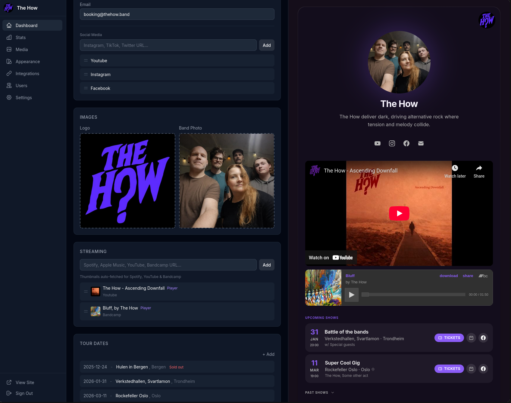
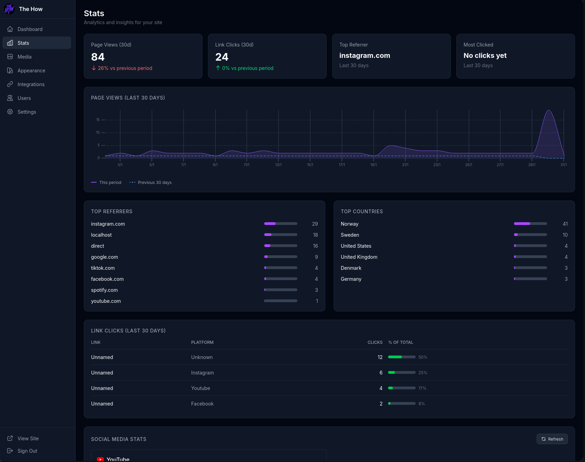
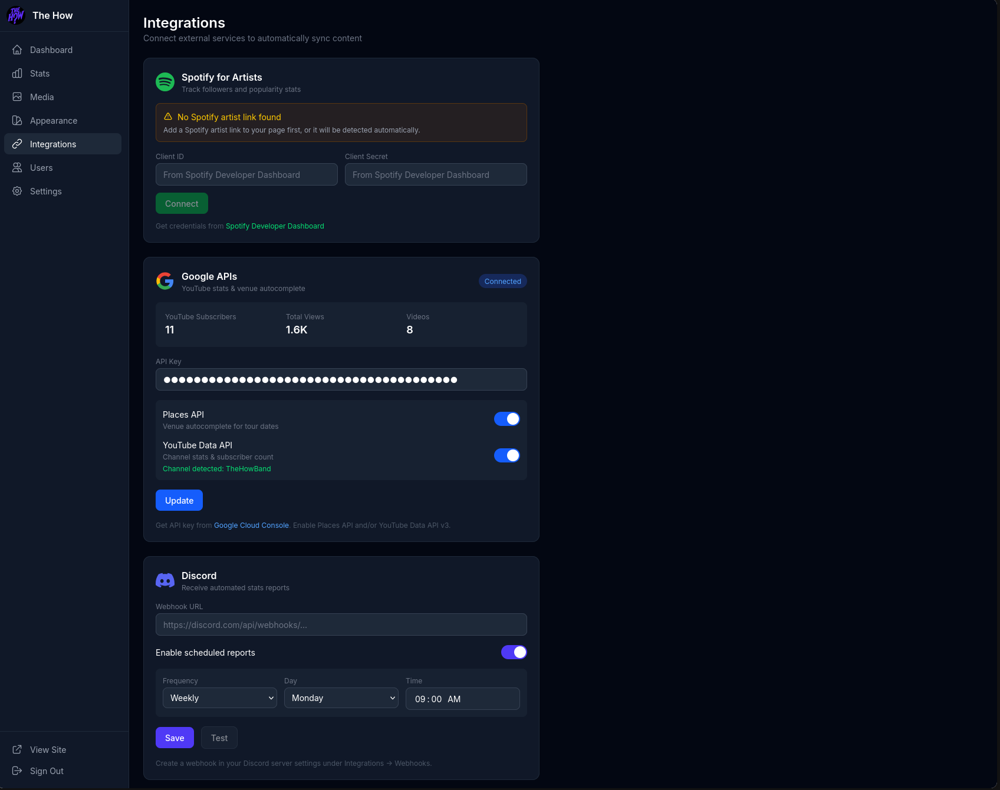
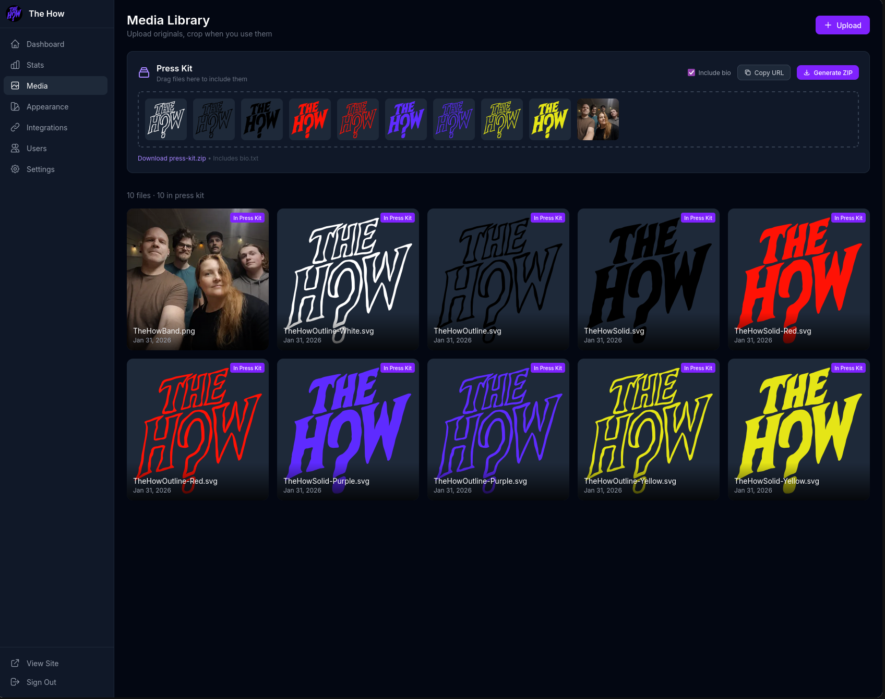
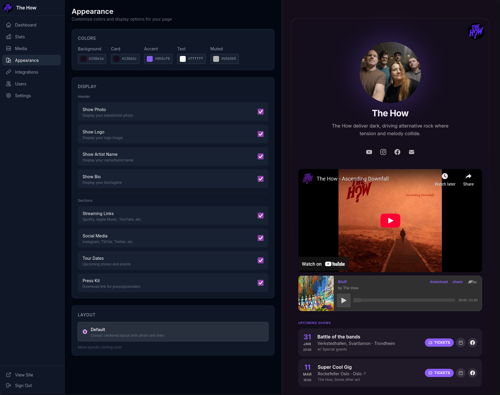

# Artistack

A self-hosted link-in-bio page for musicians and bands.



## Features

- **Profile** - Logo, photo, bio with live preview
- **Social Links** - Auto-detected platform icons
- **Streaming** - Embedded players for Spotify, YouTube, Bandcamp
- **Tour Dates** - Venue autocomplete, calendar export, ticket links
- **Stats** - Page views, link clicks, referrers, geography
- **Integrations** - Discord notifications, Spotify/YouTube stats
- **Appearance** - Customizable colors and layout
- **Media Library** - Image cropping and automatic optimization
- **Press Kit** - DnD your media and create your own press kit

<details>
<summary>More screenshots</summary>
<br>

| Stats | Integrations |
|-------|--------------|
|  |  |
|  |  |
</details>

## Tech Stack

- SvelteKit
- SQLite with Drizzle ORM
- Tailwind CSS
- Sharp for image processing
- Better Auth for authentication

## Getting Started

1. Install dependencies:
   ```bash
   bun install
   ```

2. Copy the example environment file and configure:
   ```bash
   cp .env.example .env
   ```

3. Set up the database:
   ```bash
   npx drizzle-kit push
   ```

4. Start the dev server:
   ```bash
   bun run dev
   ```

## Environment Variables

See `.env.example` for all available options:

- `ORIGIN` - Your site URL (e.g., `https://example.com`)
- `BETTER_AUTH_SECRET` - Secret key for authentication

## License

Artistack is licensed under the GNU Affero General Public License v3.0 (AGPL-3.0).

You are free to self-host, modify, and distribute Artistack. If you run a modified version as a network service, you must make your changes available under the same license.
