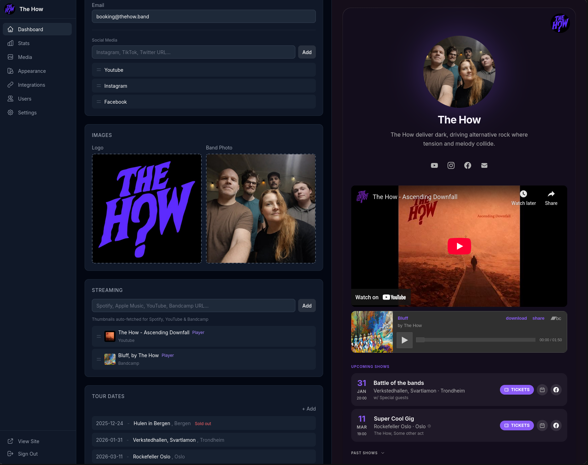
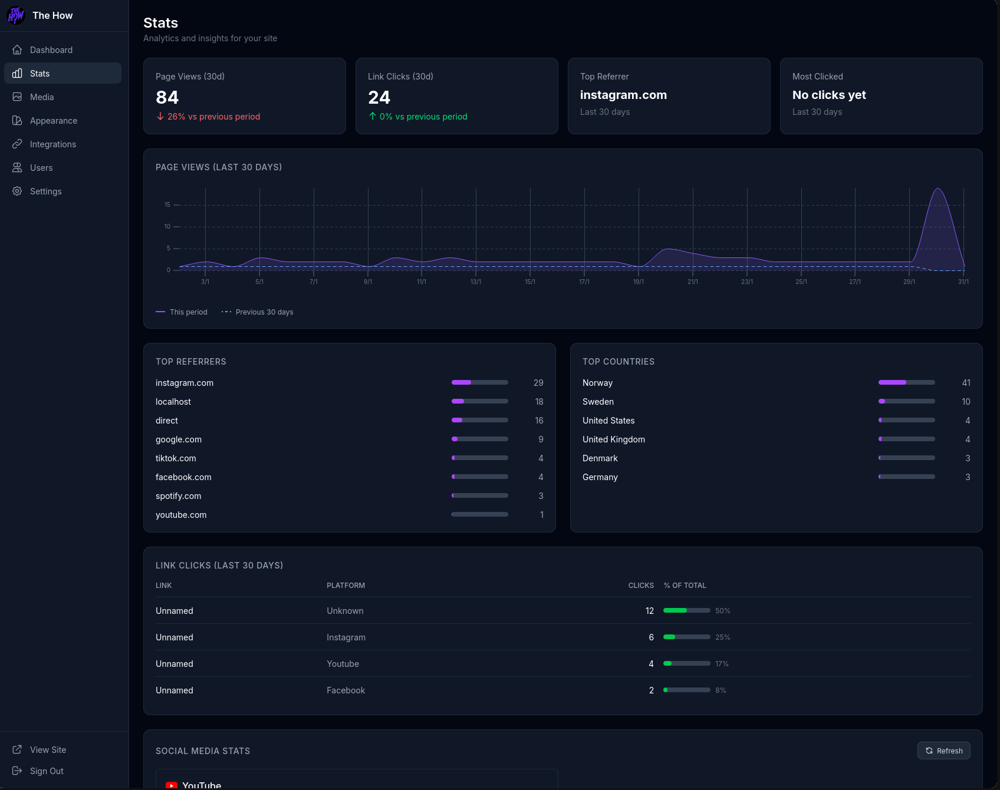
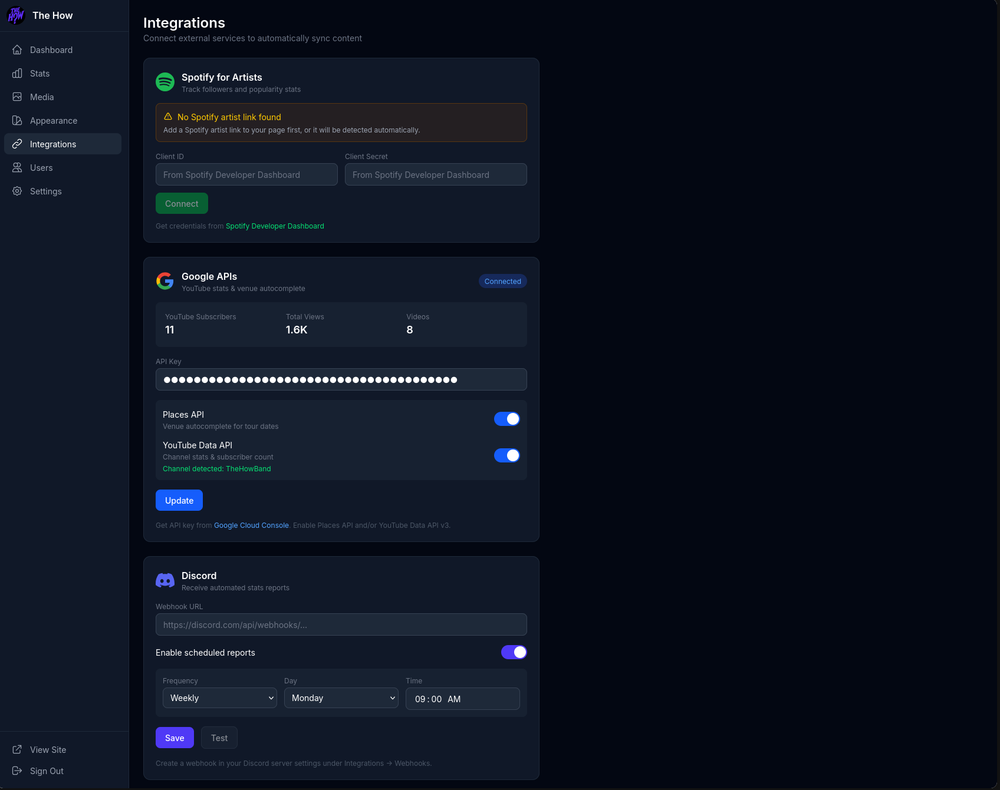
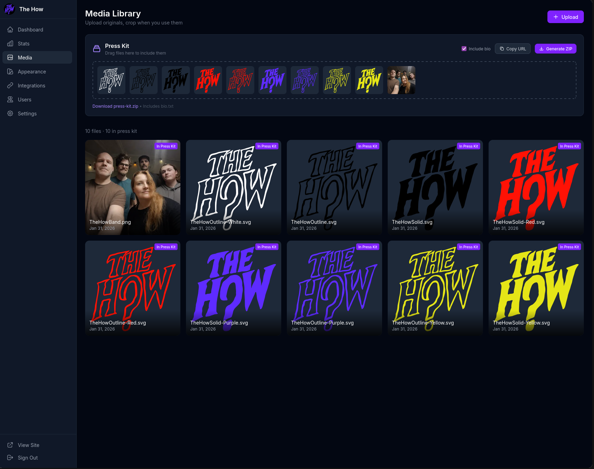
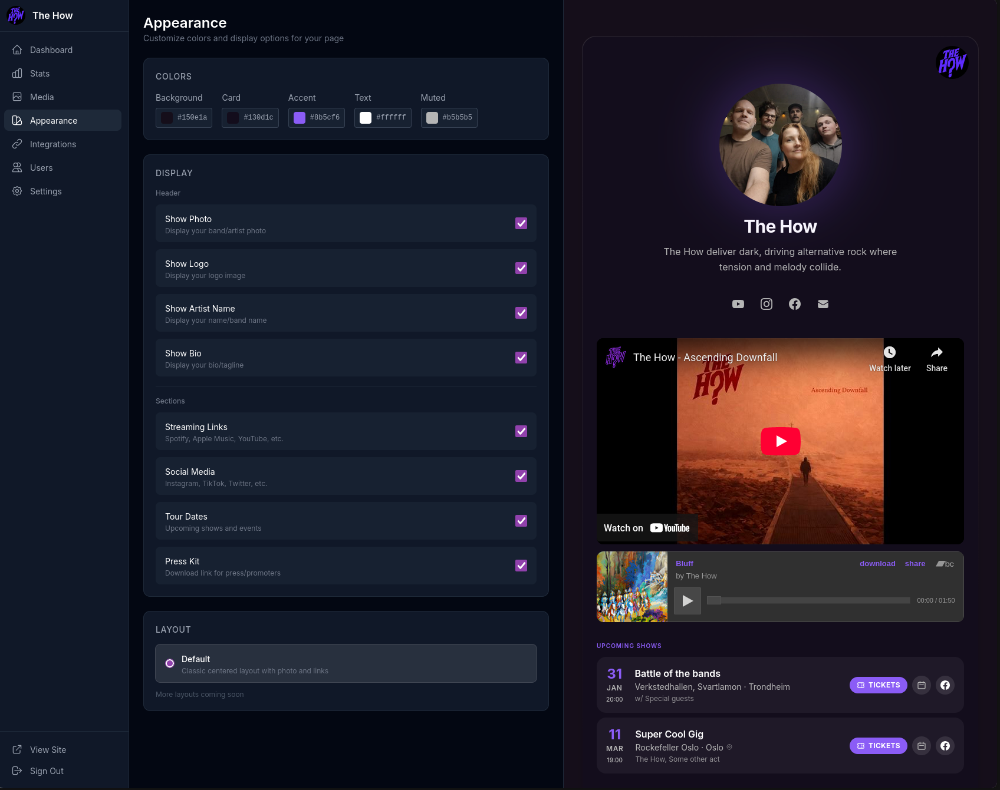

# Artistack

A self-hosted solution for artists and bands ... your links, your releases, your shows, and the clips you post about them.



<details>
<summary>More screenshots</summary>
<br>

| Stats                           | Integrations                                  |
| ------------------------------- | --------------------------------------------- |
|  |  |
|  |      |

</details>

## Features

- **Profile** - Logo, photo, bio with live preview
- **Social Links** - Auto-detected platform icons
- **Streaming** - Embedded players for Spotify, YouTube, Bandcamp
- **Releases** - A page per single or album, with buttons to every service, pre-save before the date and per-platform click tracking
- **Shows** - Venue autocomplete, a line-up of acts with set times, posters, ticket links and calendar export
- **Acts** - The bands you play with, kept once with their logos, rather than retyped per gig
- **Landing pages** - A release or a show can have its own address, in the site's own layout
- **Shop** - Merch and downloads with stock, a basket and a checkout; orders are charged when you post them, and downloads arrive on a link only the buyer has
- **Audience** - A fan list with recorded consent, one-click unsubscribe and CSV export
- **Stats** - Page views, link clicks, referrers, geography
- **Integrations** - Discord notifications, Spotify/YouTube stats
- **Appearance** - Customizable colors and layout
- **Media Library** - Image cropping and automatic optimization
- **Press Kit** - DnD your media and create your own press kit
- **Clip Studio** - Turn raw footage into branded vertical video, ready to post
- **Tags** - One shared vocabulary across clips and media

## Tech Stack

- SvelteKit
- SQLite with Drizzle ORM
- Tailwind CSS
- Sharp for image processing
- Better Auth for authentication

## Getting Started

1. Install dependencies:

   ```bash
   bun install
   ```

2. Copy the example environment file and configure:

   ```bash
   cp .env.example .env
   ```

3. Set up the database:

   ```bash
   node scripts/migrate.mjs
   ```

   Schema changes are authored with `bun run db:generate` and applied by that
   script, which also runs on `bun run start`.

4. Start the dev server:

   ```bash
   bun run dev
   ```

   It only ever writes and deletes its own fixed list of names, so it's safe to
   run against a database with real products in it.

## Environment Variables

See `.env.example` for all available options:

- `ORIGIN` - Your site URL (e.g., `https://example.com`)
- `BETTER_AUTH_BASE_URL` - Same URL; used for auth and for absolute links in published clips
- `BETTER_AUTH_SECRET` - Secret key for authentication

Rendering clips needs `ffmpeg` and `fontconfig` with at least one font installed. `nixpacks.toml` covers this for container deploys; locally, install them through your package manager.

---

⭐️ this repository if you found it useful ❤️

[![BuyMeCoffee][buymecoffebadge2]][buymecoffee]

<!-- Badges -->

[buymecoffee]: https://www.buymeacoffee.com/jonkristian
[buymecoffeebadge]: https://img.shields.io/badge/buy%20me%20a%20coffee-donate-yellow.svg?style=for-the-badge
[buymecoffebadge2]: https://bmc-cdn.nyc3.digitaloceanspaces.com/BMC-button-images/custom_images/white_img.png

## License

Artistack is licensed under the GNU Affero General Public License v3.0 (AGPL-3.0).

You are free to self-host, modify, and distribute Artistack. If you run a modified version as a network service, you must make your changes available under the same license.
